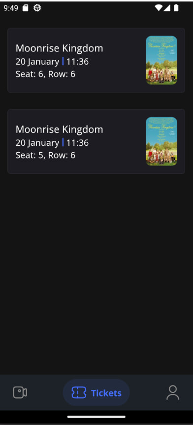
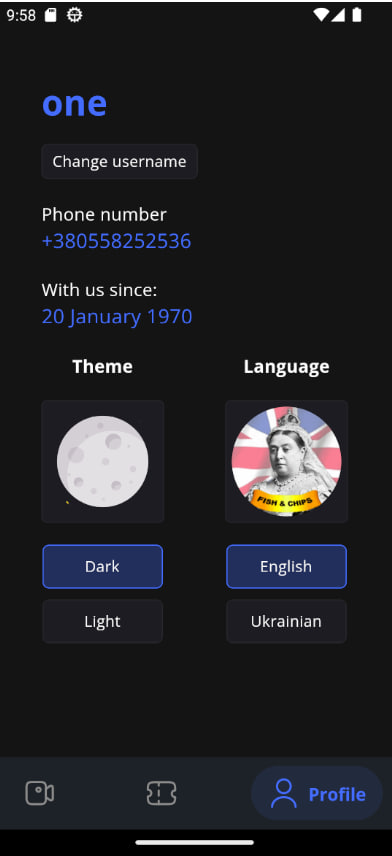
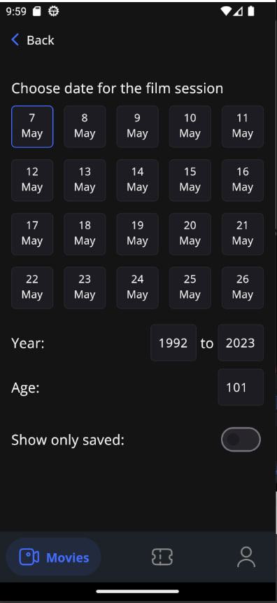
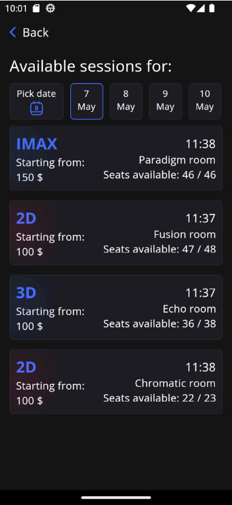
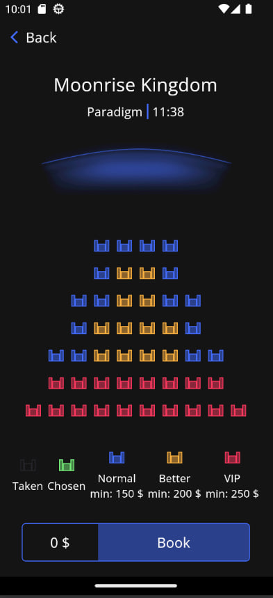
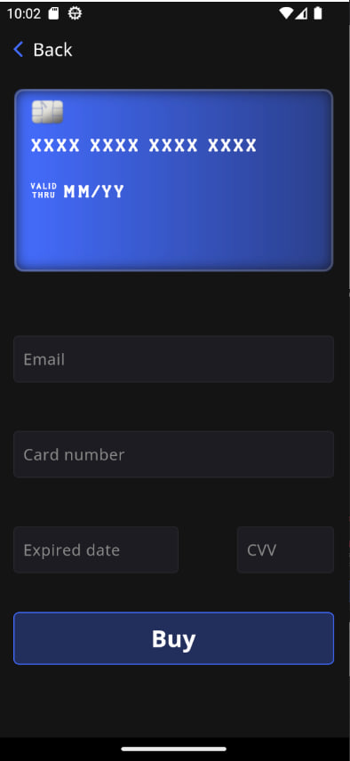

<h1 style="color: #446DFF;">Ticketeer</h1>

#### General
##### Ticketeer is a mobile movie theater app
Here you can:
- View latest releases and timeless classic
- Get detailed information about each and every movie: watch trailers, look at the cast and more...
- Share your thoughts with community of movie-lovers just like yourself
- Save your favorite movies to find them later
- Purchase tickets for our cosmically - named, intriguing sessions...
- Use generated bar-code to enter the theater and enjoy the movie
- Experience dark and light theme for your own taste
- Adapt contents of the app to english or ukrainian language
- And many more...

Only one way to discover everything - install now!
- Latest apk for Android

#### Technical information

This app was written with Clean Architecture and best software design patterns in mind. It makes use of classical Flutter packages, like:
- [bloc](https://pub.dev/packages/flutter_bloc)
- [easy localization](https://pub.dev/packages/easy_localization)
- [get it](https://pub.dev/packages/get_it)

You will be able to see the full list in pubspec.yaml file of the project.

<!-- 

  
  
  
  
  
  
  
  
  

 -->

